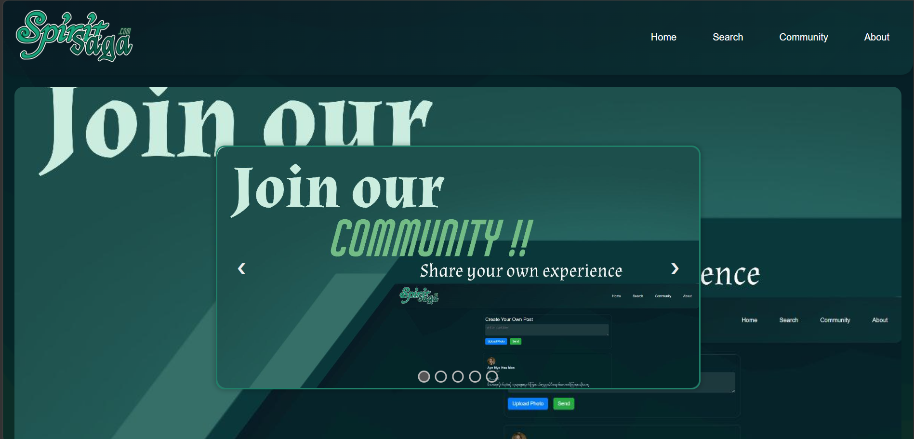

# ⛩️ Spirit Saga | Exploring Regional Folklore

Spirit Saga is a comprehensive web platform dedicated to exploring and documenting regional folklore and supernatural entities. The project aims to preserve traditional stories and cultural myths through a digital medium, providing users with an engaging and educational resource.

---

## ✨ Features
* Folklore Documentation: A curated collection of myths and legends organized by region.
* Engaging UI Design: A modern, immersive interface designed to enhance the storytelling experience.
* Responsive Layout: Fully optimized for mobile, tablet, and desktop viewing.

## 🎨 Design Overview
As a UI/UX Designer, I focused on creating a visual identity that reflects the mysterious and historical nature of folklore:
* Color Palette: Deep, atmospheric tones chosen to evoke a sense of tradition and mystery.
* Typography: Elegant and readable fonts that complement the narrative style.
* User Experience: Intuitive navigation allowing users to easily browse through different tales.

## 🛠️ Tech Stack
* Design: Figma (UI/UX Prototyping)
* Frontend: HTML5, CSS3, JavaScript
* Hosting: GitHub Pages

## 🚀 Live Demo
You can explore the live project here:
👉 [View Live Demo](https://kinnyeinchandw.github.io/Spirit_Saga/)

## 📸 Preview

---

## 👨‍💻 About the Author
Kin Nyein Chan Lwin
* University Student (Computer Science Major)
* Aspiring UI/UX Designer & Frontend Developer
* Passionate about blending technology with cultural storytelling.
